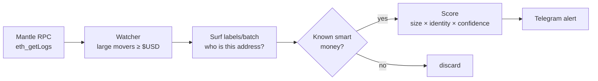

# 🌊 AlphaTide

> **Name the smart money the moment it touches Mantle.**
> A Telegram bot that detects when funds, market makers and whales — known from their Ethereum/Base history — start moving on Mantle, and tells you who they are.

[](https://www.mantle.xyz/)
[](https://core.telegram.org/bots)
[](https://www.python.org/)
[](LICENSE)

🏆 Built for **Mantle Hackathon — Phase 2: AI Awakening**, the **AI Alpha & Data** track.
🏄 Cross-chain intelligence powered by **[Surf](https://asksurf.ai/)**.

---

## 🎯 The one thing AlphaTide does that nothing else can

A Mantle block explorer can tell you *"`0xabc…` just bought $400k of mETH."*
It **cannot** tell you that `0xabc…` **is Wintermute** — because that identity lives in the wallet's history on *other* chains.

AlphaTide closes that gap:

```
Mantle on-chain event  ──▶  Surf cross-chain label DB (100M+ addresses, 13 chains)  ──▶  "Wintermute is buying mETH on Mantle"
```

That cross-chain identity *is* the alpha. It's structurally impossible to produce from Mantle data alone, which is exactly why this is worth building.

> ✅ **Verified with live data.** Against `rpc.mantle.xyz` (chainId 5000, ~2s blocks) and the Surf API, we confirmed Surf resolves real addresses to named entities — **Wintermute** (fund), **Jump Crypto** (fund), **Binance** (CEX, "Hot Wallet"), **Alameda Research** (fund) — and even labels Mantle-native contracts. The captured responses ship as demo fixtures so the full pipeline runs with no API key.

---

## 🧠 How it works



1. **Watch** — harvest large ERC-20 moves on Mantle straight from `eth_getLogs` (USDT, USDC, WMNT, mETH, WETH …), keep only movers above a USD threshold.
2. **Resolve** — batch the candidate addresses to Surf `wallet/labels/batch` (≤100/call) to learn their cross-chain identity.
3. **Filter & score** — keep only real smart money (fund / market maker / CEX / whale); score by `log(size) × identity weight × confidence`.
4. **Alert** — push ranked, deduplicated signals to Telegram.

**Credit-efficient by design:** only addresses that already cleared the on-chain USD trigger are ever sent to Surf, results are TTL-cached (an address's identity is near-constant), and lookups are batched — so each address is paid for at most once. See the bot commands below.

## 🤖 Bot commands

| Command | What it does |
|---|---|
| `/alpha` | Top cross-chain smart money signals on Mantle right now |
| `/scan` | Run a fresh detection cycle (shows movers, hits, credits used) |
| `/whale <TOKEN>` | Recent smart money in a token, e.g. `/whale mETH` |
| `/track <address>` | Who is this wallet? — Surf cross-chain identity |
| `/subscribe` | Get pushed alerts as smart money moves |

## 🛠️ Tech stack

- **Chain:** Mantle (EVM L2) — read directly via JSON-RPC, no indexer required
- **Intelligence:** Surf Data API — `wallet/labels/batch`, optional `wallet/detail` & `social/mindshare` enrichment
- **Bot:** Python 3.11+, `python-telegram-bot`
- **Detection:** USD-thresholded mover harvest + cross-chain label join + transparent scoring

## 🚀 Getting started

```bash
# 1. Install
python3 -m venv venv && source venv/bin/activate
pip install -r requirements.txt

# 2. See it work with NO keys (real detector + scorer + formatter, Surf fixtures)
python -m alphatide.demo            # scenario alerts
python -m alphatide.demo --live     # + a real scan against rpc.mantle.xyz

# 3. Run the bot
cp .env.example .env                # fill TELEGRAM_BOT_TOKEN (SURF_API_KEY optional)
python -m alphatide.bot.main
```

Without `SURF_API_KEY` the bot uses Surf's anonymous free tier (30 credits/day) and falls back to bundled fixtures — so it always runs.

## 📁 Project structure

```
alphatide/
├── data/
│   ├── mantle_client.py   # eth_getLogs watcher — large mover harvesting
│   ├── surf_client.py     # Surf labels/batch — cache + batch + offline fixtures
│   └── tokens.py          # Mantle token registry
├── analytics/
│   ├── smart_money.py     # cross-chain smart money detector (the core)
│   ├── scoring.py         # transparent, testable signal scoring
│   └── anomaly.py         # volume-baseline anomaly (secondary signal)
├── bot/                   # Telegram: handlers, formatting, push monitor
├── pipeline.py            # one detection cycle, shared by bot + demo
├── demo.py                # end-to-end demo, no keys required
└── fixtures/              # real captured Surf responses for offline mode
tests/                     # detector, scoring, cache, formatting
```

## 🗺️ Roadmap

- [x] Live Mantle watcher (`eth_getLogs`, USD-thresholded movers)
- [x] Surf cross-chain label resolution (batched + cached)
- [x] Smart money detector + transparent scoring
- [x] Telegram bot (`/alpha`, `/scan`, `/whale`, `/track`, push monitor)
- [x] Keyless end-to-end demo + test suite
- [ ] DEX swap decoding for finer "early buy" detection (Merchant Moe / Agni / FusionX)
- [ ] Live price oracle for non-stable USD valuation
- [ ] `wallet/detail` + `social/mindshare` enrichment on confirmed hits

## ⚠️ Disclaimer

Experimental hackathon software. Nothing here is financial advice. On-chain signals can be wrong, manipulated, or late — always do your own research.

## 📄 License

[MIT](LICENSE)
