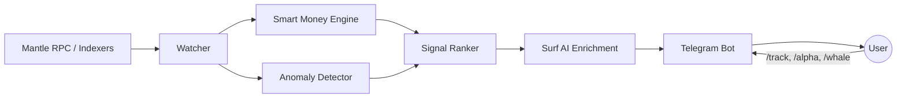

# 🌊 AlphaTide

> **AI-powered smart money tracking & on-chain anomaly detection for Mantle — delivered straight to your Telegram.**

[](https://www.mantle.xyz/)
[](https://core.telegram.org/bots)
[](https://www.python.org/)
[](LICENSE)

**AlphaTide** is an AI agent that watches the Mantle network 24/7, follows the wallets that matter, detects on-chain anomalies before they become headlines, and turns raw chain data into actionable alpha — all surfaced through a conversational Telegram bot.

🏆 Built for **[Mantle Hackathon — Phase 2: AI Awakening](https://www.mantle.xyz/)**, **AI Alpha & Data** track.
🏄 AI intelligence layer powered by **[Surf](https://asksurf.ai/)**.

---

## 🧠 The Problem

On-chain alpha decays in minutes. By the time a whale movement or liquidity anomaly is visible on a dashboard, the edge is gone. Retail users on Mantle have no realistic way to:

- Track what **smart money** (profitable wallets, funds, insiders) is actually doing in real time
- Detect **anomalies** — unusual volume spikes, liquidity pulls, swarm buying, bridge inflows — as they happen
- Translate raw transaction noise into a **human-readable thesis** they can act on

## 💡 The Solution

AlphaTide combines deterministic on-chain monitoring with an AI reasoning layer:

| Layer | What it does |
|---|---|
| 👁️ **Watcher** | Continuously ingests Mantle blocks, DEX swaps, token transfers, and bridge flows |
| 🐋 **Smart Money Engine** | Scores and follows high-PnL wallets; clusters related addresses; flags coordinated moves |
| 🚨 **Anomaly Detector** | Statistical baselines + heuristics catch volume spikes, liquidity drains, fresh-wallet swarms, and wash patterns |
| 🏄 **Surf AI Layer** | Enriches raw signals with context — token fundamentals, narrative mapping, risk assessment — and writes the alert in plain English |
| 💬 **Telegram Bot** | Pushes ranked, deduplicated alerts; answers ad-hoc questions like *"what is smart money buying on Mantle today?"* |

## ⚙️ How It Works



1. **Ingest** — The watcher polls Mantle for swaps, transfers, and liquidity events.
2. **Detect** — Smart money heuristics and statistical anomaly models score every event.
3. **Reason** — High-scoring signals are sent to Surf's AI API for context, narrative, and risk framing.
4. **Deliver** — The Telegram bot pushes concise alerts and supports interactive commands.

## 🤖 Bot Commands (planned)

| Command | Description |
|---|---|
| `/alpha` | Today's top AI-curated signals on Mantle |
| `/whale <token>` | Recent smart money activity for a token |
| `/track <address>` | Follow a wallet and get notified on its moves |
| `/anomaly` | Latest detected on-chain anomalies |
| `/ask <question>` | Free-form question answered by the Surf AI layer |

## 🛠️ Tech Stack

- **Chain**: Mantle Network (EVM L2)
- **AI**: Surf API (crypto-native reasoning & enrichment)
- **Bot**: Python 3.11+, `python-telegram-bot`
- **Data**: Mantle RPC, on-chain indexers, `web3.py`
- **Detection**: statistical baselines, wallet clustering heuristics

## 🚀 Getting Started

```bash
# 1. Clone
git clone https://github.com/SaxophoneTrom/alphatide.git
cd alphatide

# 2. Set up environment
python3 -m venv venv
source venv/bin/activate
pip install -r requirements.txt

# 3. Configure secrets (never committed)
cp .env.example .env
#    └─ fill in TELEGRAM_BOT_TOKEN, SURF_API_KEY, MANTLE_RPC_URL

# 4. Run the bot
python -m alphatide.bot.main
```

## 📁 Project Structure

```
alphatide/
├── bot/            # Telegram bot — entrypoint, command handlers, message formatting
├── core/           # Configuration, scheduling, shared utilities
├── data/           # Mantle RPC client, Surf API client, indexer adapters
└── analytics/      # Smart money scoring, anomaly detection models
tests/              # Test suite
```

## 🗺️ Roadmap

- [x] Project scaffold & architecture design
- [ ] Mantle data ingestion (swaps, transfers, liquidity events)
- [ ] Smart money wallet scoring & clustering
- [ ] Anomaly detection baselines
- [ ] Surf AI enrichment pipeline
- [ ] Telegram bot MVP (`/alpha`, `/whale`, `/track`)
- [ ] Alert ranking & deduplication
- [ ] Demo deployment for hackathon judging

## ⚠️ Disclaimer

AlphaTide is experimental hackathon software. Nothing it produces is financial advice. On-chain signals can be wrong, manipulated, or late — always do your own research.

## 📄 License

[MIT](LICENSE)
